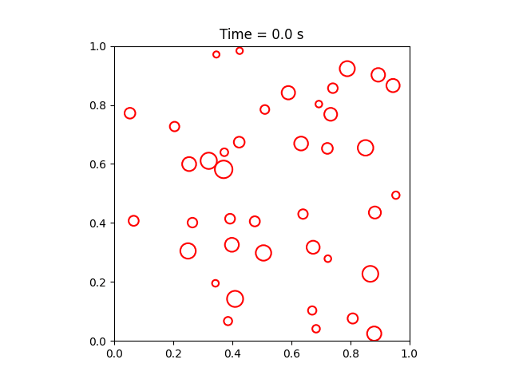

# Particles in a box DEMO

This is a demo repository intended for demonstrating git, python unit testing and automatic documentation rendering

The actual code is simulation of particles bouncing in a box in two dimensions.  

Parts of the code are from [https://scipython.com/blog/two-dimensional-collisions/](https://scipython.com/blog/two-dimensional-collisions/)

# Animation produced in app.py

